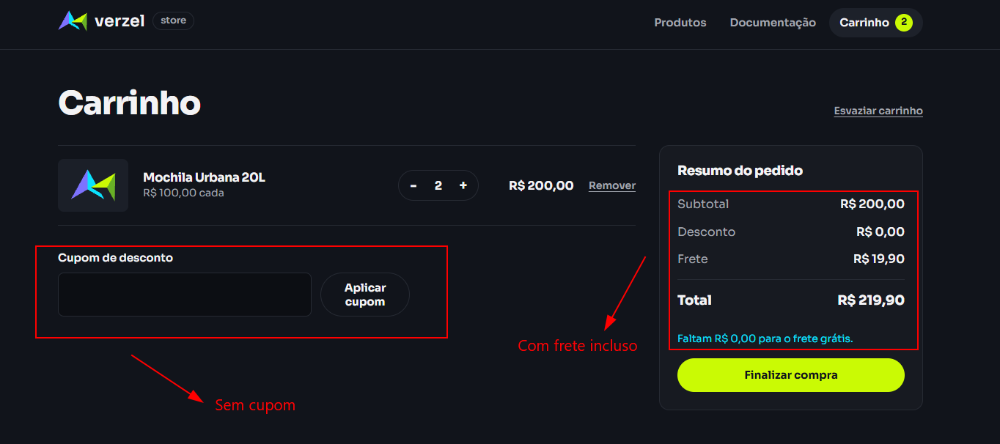
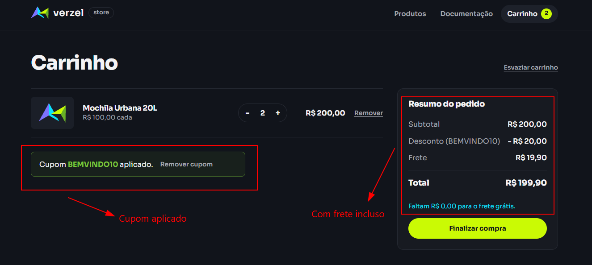

# BUG-001: Frete grátis não é aplicado quando o subtotal é exatamente R$ 200,00

## 2. Identificação

| ID | Status | Severidade | Prioridade | Camada | Funcionalidade | Critérios de aceite relacionados | Cenários de teste relacionados | Data e hora da observação | Reprodutibilidade |
|---|---|---|---|---|---|---|---|---|---|
| BUG-001 | Aberto | Alta | Alta | Interface e API | Cálculo de frete grátis no limite | CA06 e CA08 | CT-API-CARRINHO-02, CT-API-CARRINHO-08, CT-FRETE-02, CT-FRETE-04 | API: 06/10/2026, 19:57:19 e 20:36:30; interface: 06/10/2026, 19:12:02 e 20:36:47 (UTC−03:00) | As duas execuções registradas de cada camada reproduziram as divergências dos cenários automatizados. |

## 3. Ambiente

- URL da loja: https://verzel-store.qa-test-verzel-store.workers.dev/
- Entrega: VZS-142, versão 2.3.0.
- Sistema operacional: Windows (versão não registrada).
- Node.js: v24.21.0.
- Playwright: 1.63.0.
- Navegador nos testes automatizados de interface: Chromium 153.0.8010.12.
- Testes de API usam `APIRequestContext`, sem navegador.
- Navegador e versão usados na execução manual: [preencher: navegador e versão usados na execução manual].

## 4. Resumo

Com duas Mochilas Urbanas 20L, a loja cobra frete mesmo com subtotal de R$ 200,00. O comportamento foi observado na interface e nas duas chamadas de cálculo da API, com e sem o cupom BEMVINDO10.

## 5. Pré-condições

- A loja está acessível.
- O produto P005, Mochila Urbana 20L, custa R$ 100,00.
- Para a variante com cupom, BEMVINDO10 está ativo e aplica 10% de desconto.

## 6. Passos para reproduzir

### Na interface

1. Abrir a loja.
2. Na vitrine, clicar duas vezes em “Adicionar ao carrinho” para Mochila Urbana 20L (R$ 100,00 cada).
3. Abrir o carrinho. Foram observados subtotal de R$ 200,00, frete de R$ 19,90, total de R$ 219,90 e o texto “Faltam R$ 0,00 para o frete grátis.”
4. Para testar o cupom, preencher “Cupom de desconto” com `BEMVINDO10` e clicar em “Aplicar cupom”.
5. Foram observados desconto de R$ 20,00, frete de R$ 19,90 e total de R$ 199,90.

### Na API

1. Enviar o pedido de cálculo sem cupom:

```sh
curl -X POST "https://verzel-store.qa-test-verzel-store.workers.dev/api/carrinho/calcular" -H "Content-Type: application/json" -d '{"itens":[{"produtoId":"P005","quantidade":2}]}'
```

   A resposta observada foi HTTP 200, subtotal 200, frete 19.9 e total 219.9.

2. Repetir com BEMVINDO10:

```sh
curl -X POST "https://verzel-store.qa-test-verzel-store.workers.dev/api/carrinho/calcular" -H "Content-Type: application/json" -d '{"itens":[{"produtoId":"P005","quantidade":2}],"cupom":"BEMVINDO10"}'
```

   A resposta observada foi HTTP 200, subtotal 200, desconto 20, frete 19.9 e total 199.9.

## 7. Resultado esperado

- Sem cupom: subtotal R$ 200,00, frete R$ 0,00 e total R$ 200,00.
- Com BEMVINDO10: subtotal R$ 200,00, desconto R$ 20,00, frete R$ 0,00 e total R$ 180,00.
- Fonte: análise da documentação, seção 2, CA06 e CA08; seção 3.1, cálculo do frete e fórmula do total.

## 8. Resultado obtido

### Interface

- CT-FRETE-02: subtotal R$ 200,00, desconto R$ 0,00, frete R$ 19,90, total R$ 219,90. Texto exibido: “Faltam R$ 0,00 para o frete grátis.”
- CT-FRETE-04: subtotal R$ 200,00, desconto de R$ 20,00, frete R$ 19,90 e total R$ 199,90. Texto de cupom exibido: “Cupom BEMVINDO10 aplicado.” Texto de frete exibido: “Faltam R$ 0,00 para o frete grátis.”

### API

CT-API-CARRINHO-02, HTTP 200:

```json
{
  "itens": [
    {
      "produtoId": "P005",
      "nome": "Mochila Urbana 20L",
      "precoUnitario": 100,
      "quantidade": 2,
      "total": 200
    }
  ],
  "subtotal": 200,
  "desconto": 0,
  "frete": 19.9,
  "freteGratis": false,
  "valorFaltanteFreteGratis": 0,
  "total": 219.9,
  "cupom": null
}
```

CT-API-CARRINHO-08, HTTP 200:

```json
{
  "itens": [
    {
      "produtoId": "P005",
      "nome": "Mochila Urbana 20L",
      "precoUnitario": 100,
      "quantidade": 2,
      "total": 200
    }
  ],
  "subtotal": 200,
  "desconto": 20,
  "frete": 19.9,
  "freteGratis": false,
  "valorFaltanteFreteGratis": 0,
  "total": 199.9,
  "cupom": {
    "codigo": "BEMVINDO10",
    "aplicado": true,
    "mensagem": "Cupom aplicado: 10% de desconto nos produtos."
  }
}
```

Em ambas as respostas, `valorFaltanteFreteGratis` é 0, embora `freteGratis` seja `false` e o frete seja cobrado.

## 9. Comparação

| Campo | Esperado | Obtido |
|---|---|---|
| Subtotal | R$ 200,00 | R$ 200,00 |
| Desconto sem cupom | R$ 0,00 | R$ 0,00 |
| Desconto com BEMVINDO10 | R$ 20,00 | R$ 20,00 |
| Frete em ambas as variantes | R$ 0,00 | R$ 19,90 |
| Total sem cupom | R$ 200,00 | R$ 219,90 |
| Total com cupom | R$ 180,00 | R$ 199,90 |
| Indicador de elegibilidade na API | Frete grátis verdadeiro | `freteGratis: false`; `valorFaltanteFreteGratis: 0` |

## 10. Evidências

- [CT-API-CARRINHO-02-resposta.json](../evidencias/api/CT-API-CARRINHO-02-resposta.json) — requisição e resposta do cálculo sem cupom.
- [CT-API-CARRINHO-08-resposta.json](../evidencias/api/CT-API-CARRINHO-08-resposta.json) — requisição e resposta do cálculo com BEMVINDO10.
- 
- 

## 11. Impacto

O cliente pode pagar frete em uma compra que atende ao limite documentado para frete grátis, inclusive quando usa o cupom válido.

## 12. Hipótese de causa

**Hipótese:** a condição de elegibilidade pode estar usando comparação estrita (`>`), em vez de incluir o subtotal igual ao limite (`>=`). A hipótese é compatível com o comportamento observado, mas não foi confirmada por inspeção da implementação.

## 13. Observações

- A resposta da API é internamente inconsistente: informa `valorFaltanteFreteGratis: 0`, mas mantém `freteGratis: false` e cobra frete.
- Não foi reportado CT-CALCULO-01: consta como manual e não executado no relatório de execução.
- As capturas manuais do carrinho sem cupom e com cupom estão anexadas.
