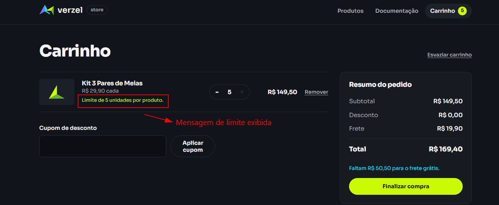

# BUG-002: A API não aplica o limite de 5 unidades por produto

## 2. Identificação

| ID | Status | Severidade | Prioridade | Camada | Funcionalidade | Critérios de aceite relacionados | Cenários de teste relacionados | Data e hora da observação | Reprodutibilidade |
|---|---|---|---|---|---|---|---|---|---|
| BUG-002 | Aberto | Média | Média | API | Limite de quantidade por produto | CA10; código `QUANTIDADE_MAXIMA_EXCEDIDA` na seção 3.4 da análise | CT-QUANTIDADE-04 (`/api/carrinho/calcular` e `/api/pedidos`); CT-QUANTIDADE-02 como contraste de interface | API: 06/10/2026, 19:57:19, 20:26:13 e 20:36:30 (UTC−03:00); interface: 06/10/2026, 19:12:02 e 20:36:47 (UTC−03:00) | Os dois endpoints excederam o limite nas execuções de API registradas. `/api/pedidos` também retornou HTTP 201 na reexecução isolada das 20:26:13. A interface bloqueou o excedente nas execuções registradas. |

## 3. Ambiente

- URL da loja: https://verzel-store.qa-test-verzel-store.workers.dev/
- Entrega: VZS-142, versão 2.3.0.
- Sistema operacional: Windows (versão não registrada).
- Node.js: v24.21.0.
- Playwright: 1.63.0.
- Navegador nos testes automatizados de interface: Chromium 153.0.8010.12.
- Os testes de API usam `APIRequestContext`, sem navegador.
- Navegador e versão usados na execução manual: [preencher: navegador e versão usados na execução manual].

## 4. Resumo

O critério de quantidade máxima é respeitado pelo fluxo automatizado de interface, mas não pelas rotas de API testadas. A API calculou um carrinho com seis unidades e também confirmou um pedido com seis unidades.

## 5. Pré-condições

- A loja/API está acessível.
- O produto P006, Kit 3 Pares de Meias, custa R$ 29,90.
- O pedido usa os dados de cliente válido registrados na evidência atual: Lucas José, `lucas@exemplo.com`, CEP `01310-100`.

## 6. Passos para reproduzir

### Na API

1. Enviar seis unidades a `/api/carrinho/calcular`:

```sh
curl -X POST "https://verzel-store.qa-test-verzel-store.workers.dev/api/carrinho/calcular" -H "Content-Type: application/json" -d '{"itens":[{"produtoId":"P006","quantidade":6}]}'
```

   Foi recebido HTTP 200 e a resposta calculou quantidade 6, subtotal 179.4, frete 19.9 e total 199.3.

2. Enviar seis unidades a `/api/pedidos`:

```sh
curl -X POST "https://verzel-store.qa-test-verzel-store.workers.dev/api/pedidos" -H "Content-Type: application/json" -d '{"cliente":{"nome":"Lucas José","email":"lucas@exemplo.com","cep":"01310-100"},"itens":[{"produtoId":"P006","quantidade":6}]}'
```

   Foi recebido HTTP 201; a resposta confirmou o pedido `VZ-626680` com seis unidades.

### Na interface — comportamento correto relacionado

1. Abrir a loja.
2. Tentar adicionar seis unidades do Kit 3 Pares de Meias.
3. O botão de adicionar ficou desabilitado após cinco unidades; foi exibido “Limite de 5 unidades atingido.”
4. Abrir o carrinho: a quantidade permaneceu 5 e o subtotal foi R$ 149,50. CT-QUANTIDADE-02 passou na execução automatizada.

## 7. Resultado esperado

- Cada produto pode ter no máximo cinco unidades por pedido.
- A API deve rejeitar seis unidades nos dois endpoints com HTTP 422 e código `QUANTIDADE_MAXIMA_EXCEDIDA`.
- Fonte: análise da documentação, seção 2, CA10; seção 3.4, tabela de códigos de erro.

## 8. Resultado obtido

### API — `/api/carrinho/calcular`, HTTP 200

```json
{
  "itens": [
    {
      "produtoId": "P006",
      "nome": "Kit 3 Pares de Meias",
      "precoUnitario": 29.9,
      "quantidade": 6,
      "total": 179.4
    }
  ],
  "subtotal": 179.4,
  "desconto": 0,
  "frete": 19.9,
  "freteGratis": false,
  "valorFaltanteFreteGratis": 20.6,
  "total": 199.3,
  "cupom": null
}
```

### API — `/api/pedidos`, HTTP 201

```json
{
  "numero": "VZ-626680",
  "criadoEm": "2026-10-06T23:25:09.514Z",
  "cliente": {
    "nome": "Lucas José",
    "email": "lucas@exemplo.com",
    "cep": "01310100"
  },
  "itens": [
    {
      "produtoId": "P006",
      "nome": "Kit 3 Pares de Meias",
      "precoUnitario": 29.9,
      "quantidade": 6,
      "total": 179.4
    }
  ],
  "subtotal": 179.4,
  "desconto": 0,
  "frete": 19.9,
  "freteGratis": false,
  "valorFaltanteFreteGratis": 20.6,
  "total": 199.3,
  "cupom": null
}
```

### Interface — contraste

CT-QUANTIDADE-02 passou: o botão de adicionar ficou desabilitado, a interface exibiu “Limite de 5 unidades atingido.” e o carrinho permaneceu com quantidade 5 e subtotal de R$ 149,50.

## 9. Comparação

| Campo | Esperado | `/api/carrinho/calcular` | `/api/pedidos` |
|---|---|---|---|
| Status | 422 | 200 | 201 |
| Código de erro | `QUANTIDADE_MAXIMA_EXCEDIDA` | Não retornado; cálculo concluído | Não retornado; pedido criado |
| Quantidade do P006 | Recusada acima de 5 | 6 | 6 |
| Subtotal | Não aplicável à requisição recusada | 179.4 | 179.4 |
| Total | Não aplicável à requisição recusada | 199.3 | 199.3 |

## 10. Evidências

- [CT-QUANTIDADE-04-api-carrinho-calcular-resposta.json](../evidencias/api/CT-QUANTIDADE-04-api-carrinho-calcular-resposta.json) — corpo e resposta do cálculo com seis unidades.
- [CT-QUANTIDADE-04-api-pedidos-resposta.json](../evidencias/api/CT-QUANTIDADE-04-api-pedidos-resposta.json) — corpo e resposta do pedido confirmado com seis unidades.
- 

## 11. Impacto

Uma chamada direta à API pode calcular ou confirmar um pedido acima do limite documentado, enquanto a interface bloqueia a quantidade excedente.

## 12. Hipótese de causa

**Hipótese:** a validação do limite de quantidade não está sendo aplicada no servidor. Não houve inspeção do código do serviço; a causa não está confirmada.

## 13. Observações

- A interface passou CT-QUANTIDADE-02 e constitui contraste com o comportamento da API.
- Os pedidos são fictícios e não são armazenados, conforme os comportamentos esperados do ambiente.
- A captura manual do bloqueio de quantidade na interface está anexada.
