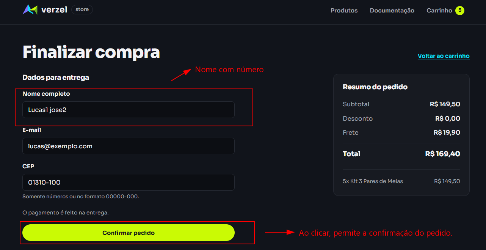
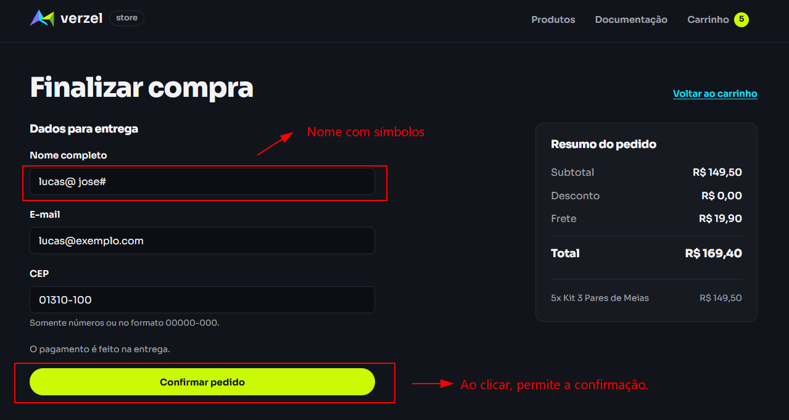
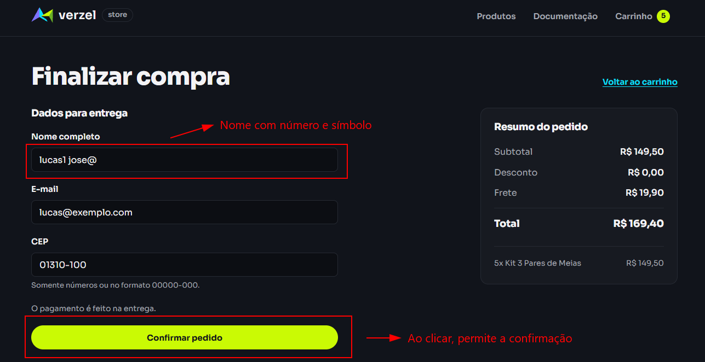

# BUG-003: O campo nome aceita números e símbolos

> **Nota de requisito:** a documentação exige nome e sobrenome, mas não define quais caracteres são permitidos no nome. A expectativa de rejeição descrita neste relatório não está explícita; baseia-se em prática comum de validação de campos de nome e deve ser revisada como requisito implícito.

## 2. Identificação

| ID | Status | Severidade | Prioridade | Camada | Funcionalidade | Critérios de aceite relacionados | Cenários de teste relacionados | Data e hora da observação | Reprodutibilidade |
|---|---|---|---|---|---|---|---|---|---|
| BUG-003 | Aberto | Baixa | Baixa | Interface e API | Validação do nome do cliente | Regra de cliente, seção 3.2 da análise; não há critério explícito sobre os caracteres permitidos | CT-CLIENTE-05 (três exemplos); CT-INTERFACE-05 (observação manual informada) | API: 06/10/2026, 19:57:19, 20:21:06 e 20:36:30 (UTC−03:00). Data/hora da observação manual: não registrada. | Os três exemplos da API retornaram HTTP 201 nas execuções de API registradas. A observação de interface foi informada sem registro de data/hora. |

## 3. Ambiente

- URL da loja: https://verzel-store.qa-test-verzel-store.workers.dev/
- Entrega: VZS-142, versão 2.3.0.
- Sistema operacional: Windows (versão não registrada).
- Node.js: v24.21.0.
- Playwright: 1.63.0.
- Navegador nos testes automatizados de interface: Chromium 153.0.8010.12.
- Testes automatizados de API usam `APIRequestContext`, sem navegador.
- Navegador e versão usados na execução manual: [preencher: navegador e versão usados na execução manual].

## 4. Resumo

Os três nomes de teste foram aceitos pela API e os pedidos foram criados. A solicitação desta Etapa também informa que os três nomes foram aceitos no fluxo manual da interface, mas não há captura ou data/hora dessa observação no repositório.

## 5. Pré-condições

- A loja/API está acessível.
- Usar P005, Mochila Urbana 20L, em quantidade 1.
- Usar os demais dados válidos exatamente como registrados nas evidências da execução automatizada.
- Considerar a ressalva de requisito implícito destacada no início deste relatório.

## 6. Passos para reproduzir

### Na interface

Conforme a observação manual informada na solicitação desta Etapa:

1. Abrir a loja.
2. Adicionar um produto ao carrinho.
3. Abrir o carrinho e seguir para o fechamento do pedido.
4. Preencher o nome com um dos valores abaixo e informar e-mail e CEP válidos:
   - `lucas1 jose2`
   - `lucas@ jose#`
   - `lucas1 jose@`
5. Confirmar o pedido.
6. Repetir o fluxo com cada nome. A observação informada foi que os três pedidos foram aceitos.

Não se registrou o texto exato da tela, a data/hora, o corpo completo enviado pela interface ou uma captura correspondente.

### Na API

Enviar cada corpo registrado pelo teste para `POST /api/pedidos`.

1. Nome `lucas1 jose2`:

```sh
curl -X POST "https://verzel-store.qa-test-verzel-store.workers.dev/api/pedidos" -H "Content-Type: application/json" -d '{"cliente":{"nome":"lucas1 jose2","email":"lucas@exemplo.com","cep":"01310-100"},"itens":[{"produtoId":"P005","quantidade":1}]}'
```

   Resultado observado: HTTP 201; pedido `VZ-168747` criado.

2. Nome `lucas@ jose#`:

```sh
curl -X POST "https://verzel-store.qa-test-verzel-store.workers.dev/api/pedidos" -H "Content-Type: application/json" -d '{"cliente":{"nome":"lucas@ jose#","email":"lucas@exemplo.com","cep":"01310-100"},"itens":[{"produtoId":"P005","quantidade":1}]}'
```

   Resultado observado: HTTP 201; pedido `VZ-626198` criado.

3. Nome `lucas1 jose@`:

```sh
curl -X POST "https://verzel-store.qa-test-verzel-store.workers.dev/api/pedidos" -H "Content-Type: application/json" -d '{"cliente":{"nome":"lucas1 jose@","email":"lucas@exemplo.com","cep":"01310-100"},"itens":[{"produtoId":"P005","quantidade":1}]}'
```

   Resultado observado: HTTP 201; pedido `VZ-082874` criado.

## 7. Resultado esperado

Com base na expectativa de requisito implícito para caracteres em nomes, os pedidos deveriam ser recusados; na API, HTTP 422 e código `DADOS_INVALIDOS`. A documentação, seção 3.2, exige nome e sobrenome, mas não define os caracteres permitidos. Esta expectativa requer revisão do responsável.

## 8. Resultado obtido

### Interface

A solicitação desta Etapa informa que o fluxo manual aceitou os três nomes. Não foi fornecido o texto exato exibido; a evidência de interface e o horário da execução não constam no repositório.

### API

Todos os três casos retornaram HTTP 201 e preservaram o nome enviado na resposta.

`lucas1 jose2`:

```json
{
  "numero": "VZ-168747",
  "criadoEm": "2026-10-06T23:20:09.511Z",
  "cliente": {
    "nome": "lucas1 jose2",
    "email": "lucas@exemplo.com",
    "cep": "01310100"
  },
  "itens": [
    {
      "produtoId": "P005",
      "nome": "Mochila Urbana 20L",
      "precoUnitario": 100,
      "quantidade": 1,
      "total": 100
    }
  ],
  "subtotal": 100,
  "desconto": 0,
  "frete": 19.9,
  "freteGratis": false,
  "valorFaltanteFreteGratis": 100,
  "total": 119.9,
  "cupom": null
}
```

`lucas@ jose#`:

```json
{
  "numero": "VZ-626198",
  "criadoEm": "2026-10-06T23:20:10.179Z",
  "cliente": {
    "nome": "lucas@ jose#",
    "email": "lucas@exemplo.com",
    "cep": "01310100"
  },
  "itens": [
    {
      "produtoId": "P005",
      "nome": "Mochila Urbana 20L",
      "precoUnitario": 100,
      "quantidade": 1,
      "total": 100
    }
  ],
  "subtotal": 100,
  "desconto": 0,
  "frete": 19.9,
  "freteGratis": false,
  "valorFaltanteFreteGratis": 100,
  "total": 119.9,
  "cupom": null
}
```

`lucas1 jose@`:

```json
{
  "numero": "VZ-082874",
  "criadoEm": "2026-10-06T23:20:10.823Z",
  "cliente": {
    "nome": "lucas1 jose@",
    "email": "lucas@exemplo.com",
    "cep": "01310100"
  },
  "itens": [
    {
      "produtoId": "P005",
      "nome": "Mochila Urbana 20L",
      "precoUnitario": 100,
      "quantidade": 1,
      "total": 100
    }
  ],
  "subtotal": 100,
  "desconto": 0,
  "frete": 19.9,
  "freteGratis": false,
  "valorFaltanteFreteGratis": 100,
  "total": 119.9,
  "cupom": null
}
```

## 9. Comparação

| Campo | Esperado (requisito implícito, sujeito a revisão) | Obtido na API |
|---|---|---|
| Nome com números `lucas1 jose2` | Pedido recusado; HTTP 422, `DADOS_INVALIDOS` | HTTP 201; pedido `VZ-168747` criado; nome aceito como enviado |
| Nome com símbolos `lucas@ jose#` | Pedido recusado; HTTP 422, `DADOS_INVALIDOS` | HTTP 201; pedido `VZ-626198` criado; nome aceito como enviado |
| Nome com número e símbolo `lucas1 jose@` | Pedido recusado; HTTP 422, `DADOS_INVALIDOS` | HTTP 201; pedido `VZ-082874` criado; nome aceito como enviado |

## 10. Evidências

- [CT-CLIENTE-05-lucas1-jose2-resposta.json](../evidencias/api/CT-CLIENTE-05-lucas1-jose2-resposta.json) — resposta para nome com números.
- [CT-CLIENTE-05-lucas-jose-resposta.json](../evidencias/api/CT-CLIENTE-05-lucas-jose-resposta.json) — resposta para nome com símbolos.
- [CT-CLIENTE-05-lucas1-jose-resposta.json](../evidencias/api/CT-CLIENTE-05-lucas1-jose-resposta.json) — resposta para nome com número e símbolo.
- 
- 
- 

### Evidências a anexar

- [x] `docs/evidencias/api/CT-CLIENTE-05-lucas1-jose2-resposta.json`
- [x] `docs/evidencias/api/CT-CLIENTE-05-lucas-jose-resposta.json`
- [x] `docs/evidencias/api/CT-CLIENTE-05-lucas1-jose-resposta.json`
- [ ] `docs/evidencias/manual/BUG-003-nome-numero.png`
- [ ] `docs/evidencias/manual/BUG-003-nome-simbolo.png`
- [ ] `docs/evidencias/manual/BUG-003-nome-numero-simbolo.png`

## 11. Impacto

Dados de nome com números ou símbolos podem ser aceitos e registrados em um pedido, contrariando a expectativa de validação adotada para este teste. Essa expectativa permanece sujeita à definição explícita do requisito.

## 12. Hipótese de causa

Não identificada. Não houve inspeção do código de validação.

## 13. Observações

- **Requisito implícito:** a documentação não define uma lista de caracteres permitidos. A equipe responsável deve confirmar se os valores testados devem ser rejeitados antes de tratar a regra como requisito explícito.
- Os testes usam e-mail `lucas@exemplo.com` e CEP `01310-100`, conforme os corpos e evidências atuais.
- A informação sobre a interface foi fornecida na solicitação desta Etapa; não há arquivo de execução, horário ou captura no repositório que permita verificá-la independentemente.
- O campo de navegador da execução manual precisa ser preenchido pelo responsável.
