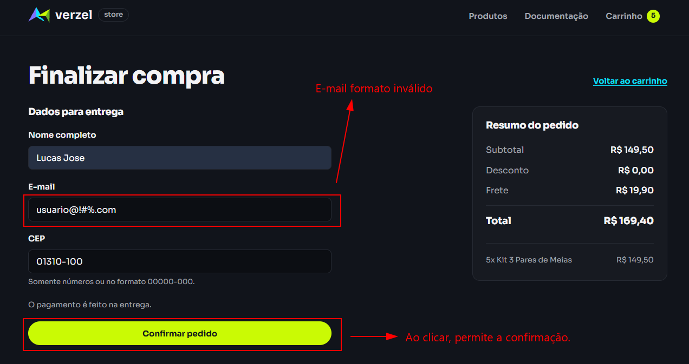

# BUG-004: O campo e-mail aceita endereço com caracteres inválidos no domínio

## 2. Identificação

| ID | Status | Severidade | Prioridade | Camada | Funcionalidade | Critérios de aceite relacionados | Cenários de teste relacionados | Data e hora da observação | Reprodutibilidade |
|---|---|---|---|---|---|---|---|---|---|
| BUG-004 | Aberto | Média | Média | Interface e API | Validação de e-mail do cliente | Regra de cliente, seção 3.2 da análise: o e-mail precisa ter formato válido; não há CA específico | CT-CLIENTE-06; CT-CLIENTE-02 como contraste; CT-INTERFACE-05 (observação manual informada) | API: 06/10/2026, 19:57:19, 20:21:06 e 20:36:30 (UTC−03:00). Data/hora da observação manual: não registrada. | CT-CLIENTE-06 retornou HTTP 201 nas execuções de API registradas. A observação da interface foi informada sem data/hora ou captura. |

## 3. Ambiente

- URL da loja: https://verzel-store.qa-test-verzel-store.workers.dev/
- Entrega: VZS-142, versão 2.3.0.
- Sistema operacional: Windows (versão não registrada).
- Node.js: v24.21.0.
- Playwright: 1.63.0.
- Navegador nos testes automatizados de interface: Chromium 153.0.8010.12.
- Testes automatizados de API usam `APIRequestContext`, sem navegador.
- Navegador e versão usados na execução manual: [preencher: navegador e versão usados na execução manual].

## 4. Resumo

O endereço `usuario@!#%.com` foi aceito pela API e o pedido foi criado. A solicitação desta Etapa também informa que o mesmo e-mail foi aceito no fluxo manual da interface, mas não há captura ou data/hora dessa observação no repositório.

## 5. Pré-condições

- A loja/API está acessível.
- Usar P005, Mochila Urbana 20L, em quantidade 1.
- Usar os demais dados exatamente como registrados na evidência atual: nome Lucas José e CEP `01310-100`.
- O e-mail sob teste é `usuario@!#%.com`.

## 6. Passos para reproduzir

### Na interface

Conforme a observação manual informada na solicitação desta Etapa:

1. Abrir a loja.
2. Adicionar um produto ao carrinho.
3. Abrir o carrinho e seguir para o fechamento do pedido.
4. Preencher o e-mail com `usuario@!#%.com` e informar nome e CEP válidos.
5. Confirmar o pedido.
6. A observação informada foi que o pedido foi aceito.

Não se registrou o texto exato exibido, a data/hora, o corpo completo enviado pela interface ou uma captura correspondente.

### Na API

Enviar o corpo registrado pelo teste para `POST /api/pedidos`:

```sh
curl -X POST "https://verzel-store.qa-test-verzel-store.workers.dev/api/pedidos" -H "Content-Type: application/json" -d '{"cliente":{"nome":"Lucas José","email":"usuario@!#%.com","cep":"01310-100"},"itens":[{"produtoId":"P005","quantidade":1}]}'
```

Resultado observado: HTTP 201; pedido `VZ-940556` criado.

## 7. Resultado esperado

O pedido deveria ser recusado por e-mail inválido; na API, HTTP 422 e código `DADOS_INVALIDOS`. Fonte: análise da documentação, seção 3.2 (regra de e-mail válido) e seção 3.4 (código `DADOS_INVALIDOS`).

## 8. Resultado obtido

### Interface

A solicitação desta Etapa informa que o fluxo manual aceitou o e-mail inválido. Não foi fornecido o texto exato exibido; a evidência de interface e o horário da execução não constam no repositório.

### API

HTTP 201:

```json
{
  "numero": "VZ-940556",
  "criadoEm": "2026-10-06T23:20:11.482Z",
  "cliente": {
    "nome": "Lucas José",
    "email": "usuario@!#%.com",
    "cep": "01310100"
  },
  "itens": [
    {
      "produtoId": "P005",
      "nome": "Mochila Urbana 20L",
      "precoUnitario": 100,
      "quantidade": 1,
      "total": 100
    }
  ],
  "subtotal": 100,
  "desconto": 0,
  "frete": 19.9,
  "freteGratis": false,
  "valorFaltanteFreteGratis": 100,
  "total": 119.9,
  "cupom": null
}
```

## 9. Comparação

| Campo | Esperado | Obtido |
|---|---|---|
| Status HTTP | 422 | 201 |
| Código | `DADOS_INVALIDOS` | Pedido criado; resposta sem código de erro |
| E-mail do cliente | Rejeitado por formato inválido | `usuario@!#%.com` aceito como enviado |
| Número do pedido | Não deve ser criado | `VZ-940556` |

## 10. Evidências

- [CT-CLIENTE-06-email-invalido-resposta.json](../evidencias/api/CT-CLIENTE-06-email-invalido-resposta.json) — requisição e resposta real da API.
- 

### Evidências a anexar

- [x] `docs/evidencias/api/CT-CLIENTE-06-email-invalido-resposta.json`
- [ ] `docs/evidencias/manual/BUG-004-email-invalido.png`

## 11. Impacto

Um pedido pode ser criado com um endereço de e-mail que a documentação caracteriza como inválido, comprometendo a qualidade dos dados de contato do pedido.

## 12. Hipótese de causa

**Hipótese:** a validação pode verificar apenas a presença de `@` e de ponto, sem validar os caracteres do domínio. Não houve inspeção do código e essa causa não está confirmada.

## 13. Observações

- Como contraste, CT-CLIENTE-02 passou: os valores `maria`, `maria@` e `maria@exemplo` foram recusados pela API.
- A documentação exige e-mail em formato válido, mas não especifica formalmente a gramática completa de endereços. O exemplo testado contém caracteres especiais no domínio.
- A informação sobre a interface foi fornecida na solicitação desta Etapa; não há arquivo de execução, horário ou captura no repositório que permita verificá-la independentemente.
- O campo de navegador da execução manual precisa ser preenchido pelo responsável.
